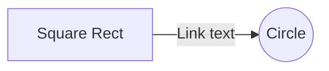

# Smart-Home Alert System

## Description
Based on the work and the *Smart-Home Alert System* proposed in [1], the case study is aimed at analyzing the impact of changes to 

## Fire Alarm 

## Carbon Monoxide Sensor

## References
  [1] Jairo Ariza, Camilo Mendoza, Kelly Garcés, and Nicolás Cardozo. "A Research Agenda for IoT Adaptive Architectures". In: *SEAMS’18, May 2018, Gothenburg, Sweden*.

